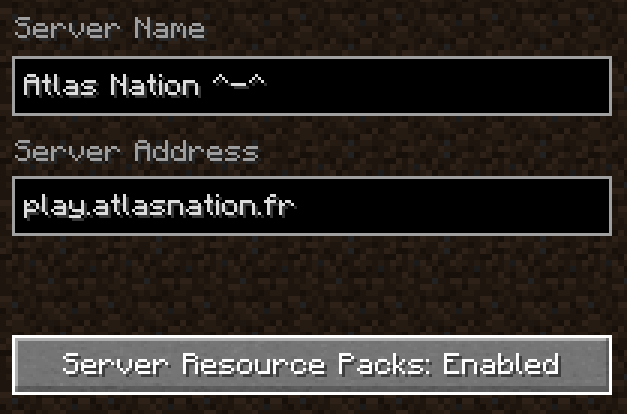

# 🎟️ Rejoindre le serveur Minecraft

Le serveur Minecraft est actuellement en version `1.20.4`. Vous pouvez le rejoindre depuis n'importe quel launcher.

Avant de vous connecter, pour bénéficier de la meilleure qualité de jeu, nous vous conseillons de jouer avec le modpack [Fabiously Optimized](https://modrinth.com/modpack/fabulously-optimized/versions), surtout si vous jouez sur des PC peu puissants.
Ce modpack vous permet entre autre, une très bonne optimisation du jeu, la possibilité d'ajouter des shaders avec Iris, une comptatibilité manette.

Une fois votre launcher favori lancé, et Fabiously Optimized installé, il est temps de se rendre dans le menu des serveurs, d'ajouter un serveur avec l'ip :

## play.atlasnation.fr

:warning: Pensez a autoriser les ressources packs !

