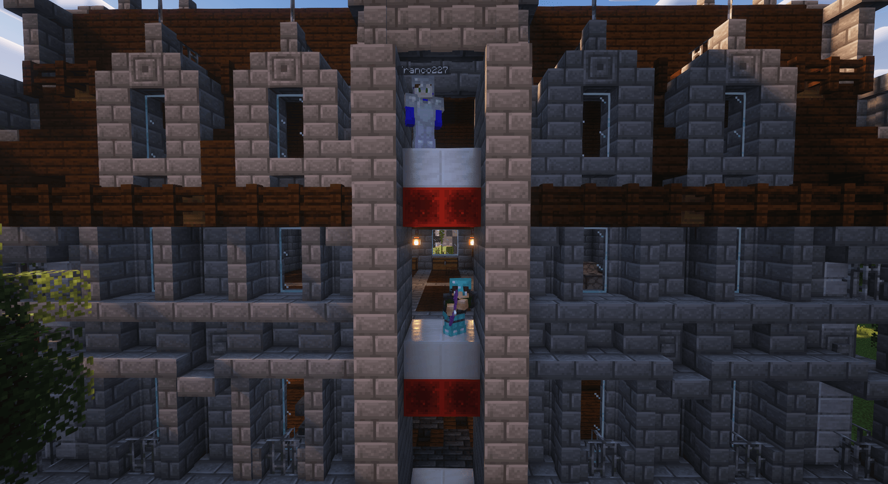

# 🛗 Ascenseur

Vous avez la possibilité de faire des ascenseurs dans vos bâtiments pour vous déplacer plus rapidement.

Vous avez besoin de 2 choses : 
- Un bloc de Redstone
- Un bloc de Quartz

L'un en dessous de l'autre et ces deux blocs a mettre a chaque étage.

Ci-dessous, un exemple de la ville de La_Rochelle, avec un acenseur a 3 étages :

